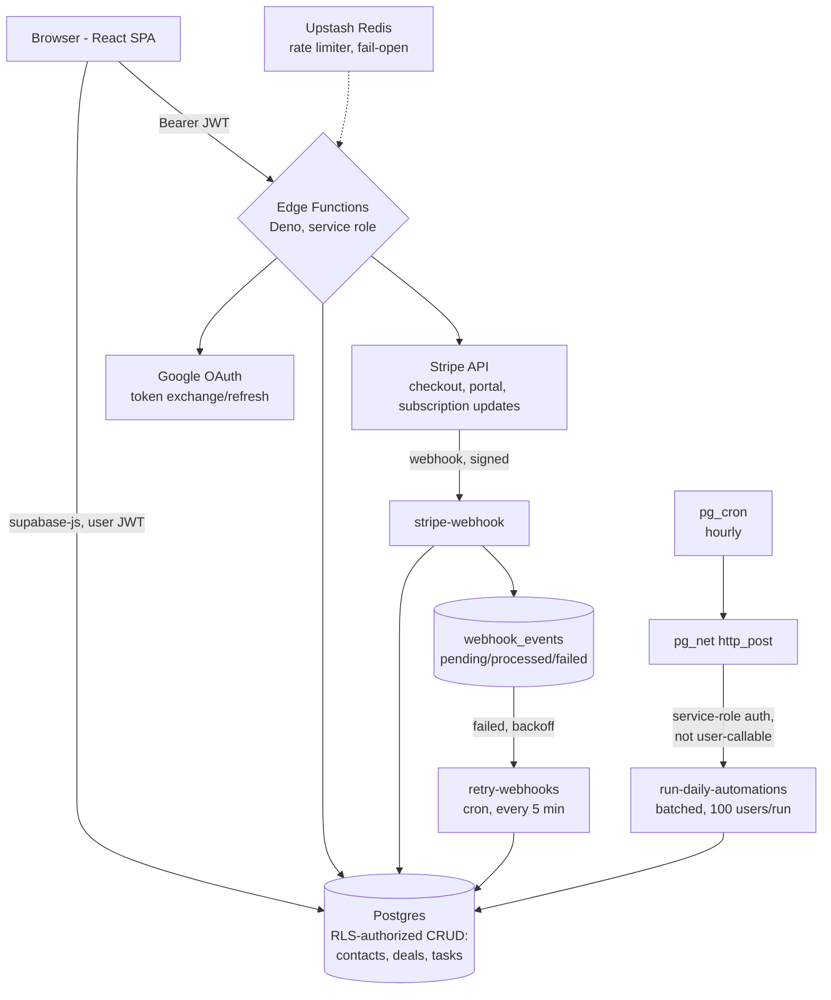

# Deskly CRM

A simple CRM for small teams - contacts, a Kanban deal pipeline, tasks, and Gmail sync, with per-seat Stripe billing and gentle server-side automations.

[](https://github.com/iPaire/deskly/actions/workflows/ci.yml)

[](https://www.desklycrm.com)

**Demo login:** `demo@desklycrm.com` / `desklydemo` - a seeded workspace with sample contacts, deals across every pipeline stage, and tasks. First login shows a short 4-step onboarding tour; use "Skip for now" to jump straight to the seeded dashboard. It's a real, permanently-active account with no attached payment method, so nothing can be charged.

---

## Overview

Deskly is a full-stack CRM built to answer one question every small team asks: who did we talk to, what did we promise them, and what's next. Contacts, deals, and tasks live in one shared team workspace; deals move across a Kanban pipeline; Gmail messages attach themselves to the right contact automatically; and a small set of automations (stale-deal alerts, overdue-task digests, auto-archiving) run server-side without needing a rules engine to babysit.

The application is a single Vite/React SPA talking almost directly to Supabase: Postgres row-level security is the authorization layer for everyday CRUD, and a handful of Deno edge functions handle the operations that must never run in the browser - Stripe billing, Google OAuth token exchange, and account deletion. There is no separate backend server to deploy or scale.

---

## Features

**Core**
- **Contacts** with custom columns, search, and a full activity history per contact.
- **Deal pipeline** - drag-and-drop Kanban board (lead → qualified → proposal → negotiation → closed won/lost) with live per-stage totals.
- **Tasks** grouped into overdue / today / upcoming and surfaced on the dashboard.
- **Gmail sync** - connect a Gmail account via OAuth; sent/received messages are logged against the matching contact automatically.

**Team & billing**
- **Shared team workspace** - invite teammates by email; everyone sees the same contacts, deals, and tasks.
- **Per-seat Stripe billing** - a 14-day free trial, then $10/seat/month via Stripe Checkout, with prorated invoicing when a seat is added mid-cycle and a self-service Customer Portal for cancellation.
- **Reliable webhook processing** - Stripe events are logged, processed idempotently, and auto-retried with backoff on failure (`webhook_events` table + a scheduled retry function), so a transient error never silently desyncs a subscription.

**Automations**
- Auto-create a follow-up task when a deal reaches Proposal, or when a new contact is added, or 3 days after an email is sent.
- Daily digest: alert when a deal has sat in a stage for 7+ days, or a task is overdue.
- Auto-archive deals closed for 30+ days to keep the pipeline clean.

**Platform**
- Dark mode, custom contact columns (up to 10), CSV-free onboarding with a guided first-contact/first-deal tour.
- SEO: server-prerendered landing page, sitemap, structured data.
- Security headers (CSP, HSTS, frame-ancestors) and Redis-backed rate limiting on sensitive endpoints, fail-open by design.

---

## Tech Stack

| Layer | Technology |
|-------|------------|
| **Frontend** | React 18, TypeScript, Vite 6, Tailwind CSS, Zustand (client state), TanStack Query (server-state caching), dnd-kit (Kanban drag-and-drop), Recharts |
| **Backend** | Supabase Postgres accessed directly from the client, authorized entirely by Row-Level Security - no custom REST/GraphQL layer for everyday CRUD |
| **Privileged operations** | Supabase Edge Functions (Deno) - Stripe billing, Google OAuth token exchange, account deletion, team invites |
| **Database** | PostgreSQL (Supabase-hosted), 91 RLS policies across 15+ tables, `pg_cron` + `pg_net` for scheduled jobs |
| **Auth** | Supabase Auth - email/password and Google OAuth |
| **Payments** | Stripe (Checkout, Customer Portal, webhooks, per-seat proration) |
| **Rate limiting** | Upstash Redis, fixed-window counters, fail-open |
| **Email** | Resend (invites, trial-ending notices) |
| **Testing** | Vitest - authorization, billing math, and the Stripe webhook handler |
| **Deployment** | Vercel (frontend), Supabase (Postgres, Auth, Edge Functions, cron) |

---

## Architecture

The frontend is a single Vite/React SPA. Most reads and writes go straight from the browser to Postgres via `supabase-js` - there's no API server in the middle, because there doesn't need to be one: Postgres itself enforces who can see and touch which rows. Anything that requires a secret the browser must never hold (a Stripe key, a Google OAuth client secret, the Postgres service role) is pushed into a Deno edge function instead.



### Tenant isolation

Every table that holds tenant data (`contacts`, `deals`, `tasks`, `automations`, …) is keyed by the **team owner's** `user_id`, not a `team_id` foreign key. A `SECURITY DEFINER` SQL function, `get_my_team_owner_id()`, resolves the calling user to their team's owner:

```sql
CREATE POLICY "contacts: select own or team"
  ON public.contacts FOR SELECT
  USING (user_id = auth.uid() OR user_id = get_my_team_owner_id());
```

Every policy on every table follows this same shape, so a member sees exactly the owner's data - nothing more - without the application ever writing a `WHERE team_id = ...` clause. Isolation is enforced by Postgres itself, not by application code remembering to filter correctly.

### Reliability

Stripe webhook events are written to a `webhook_events` table (`pending` → `processed`/`failed`) *before* being processed, so a crash mid-handler leaves a durable record rather than a lost event. A separate `retry-webhooks` function, on its own cron schedule, retries `failed` events with exponential backoff up to 5 times - using the exact same `processStripeEvent()` handler as the live webhook, so retries can never drift from first-attempt behavior.

Daily automation checks (stale deals, overdue tasks, auto-archive) are triggered by `pg_cron` once an hour, not by user page-loads - `pg_net` posts to an internal-only edge function that processes a bounded batch (100 users) and skips anyone already checked today, so the job scales by running more often rather than doing more work per run.

---

## Key Technical Decisions

**Why RLS instead of filtering in the application.** Every query the frontend sends - including ones a browser devtools session could forge - is authorized by Postgres itself, not by a `WHERE user_id = ?` clause an engineer might forget to add in a new query. A bug in a React component can produce a wrong UI; it cannot leak another tenant's rows, because the database refuses the query before the app ever sees an unauthorized row. The 91 policies in `supabase/*.sql` are the actual, current authorization logic - not a document that can drift from the code.

**Why Deno edge functions instead of a server.** Deskly needs *some* server-side code - a Stripe secret key and a Google OAuth client secret can never sit in a browser bundle - but almost none of the app's logic needs one, since RLS already protects direct-to-Postgres CRUD. Edge functions give exactly the privileged operations (billing, OAuth, admin deletes) their own isolated, scale-to-zero runtime without provisioning, patching, or paying for a server that would sit idle for the other 95% of requests.

**Why `pg_cron` for automations.** Running daily checks from the client (on dashboard load) means they only fire when someone happens to open the app, and never at all for inactive users whose deals are quietly going stale. `pg_cron` + `pg_net` moves this into the database's own scheduler - no separate worker process, no queue infrastructure, and one hourly batch job that scales by adjusting `batch_size` rather than adding infrastructure.

**Why idempotent, retried webhooks.** A payment provider's webhook can be delivered more than once, or arrive while the handler is briefly down. Logging every event to `webhook_events` before processing, checking for `processed` status before doing any work, and letting a separate cron-driven function retry `failed` events means a subscription can never get silently stuck out of sync with Stripe because of one bad request.

**Why fail-open rate limiting.** The Upstash-backed limiter treats "Redis is unreachable" as "allow the request." A rate limiter's job is to reduce abuse, not to become a second point of failure for the whole product - an outage in a supporting service should degrade protection, not take down checkout.

---

## Getting Started

```bash
git clone https://github.com/iPaire/deskly.git
cd deskly
npm install
cp .env.example .env   # fill in your own Supabase/Google values
npm run dev
```

The app runs at `http://localhost:5173`. You'll need a Supabase project with the schema in `supabase/*.sql` applied (run them in the order they were added - check `git log --diff-filter=A -- supabase/*.sql`), plus a Google OAuth client and a Stripe account if you want billing and Gmail sync to work locally. Everything else (contacts, deals, tasks, dashboard) works against just Postgres + Auth.

### Environment variables

See `.env.example`. Anything prefixed `VITE_` is bundled into the browser - only `VITE_SUPABASE_ANON_KEY` and `VITE_GOOGLE_CLIENT_ID` belong there. Everything else (`SUPABASE_SERVICE_ROLE_KEY`, `GOOGLE_CLIENT_SECRET`, `STRIPE_SECRET_KEY`, …) is an Edge Function secret, set via `supabase secrets set`, and must never carry a `VITE_` prefix.

### Running checks locally

```bash
npm run lint       # ESLint
npm run typecheck  # tsc --noEmit
npm run test       # Vitest
```

All three run in CI on every push and pull request to `master` (`.github/workflows/ci.yml`).

---

## Project Structure

```
src/
  components/     # shared UI (modals, panels, layout, route guards)
  pages/          # one file per route (Dashboard, Contacts, Deals, Tasks, Settings, ...)
  lib/            # billing, automations, gmail, supabase client - the actual business logic
  store/          # Zustand stores (auth, billing, dark mode)
supabase/
  *.sql           # schema + RLS policies, applied directly in the Supabase SQL editor
  functions/      # Deno edge functions (Stripe, Google OAuth, invites, cron targets)
    _shared/      # code shared by 2+ functions (Stripe event processing, rate limiting, seat math)
scripts/
  prerender.mjs   # SSR-renders the landing page into dist/index.html at build time
  seed-demo.mjs   # (re)populates the public demo account
```

---

## Author

[iPaire](https://github.com/iPaire)
